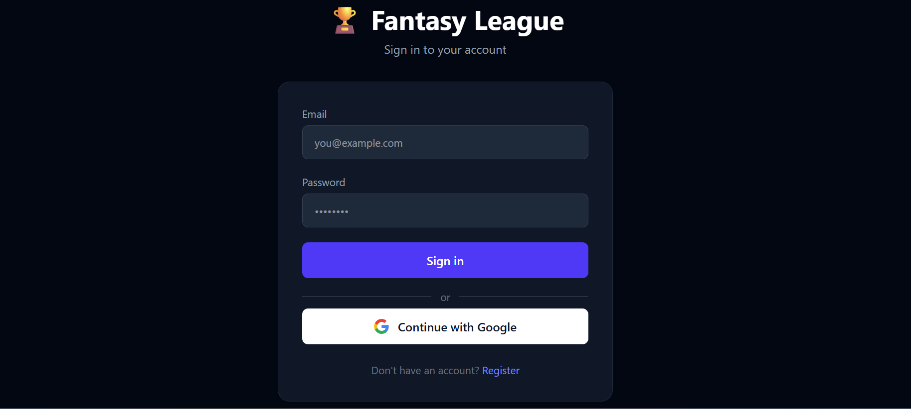
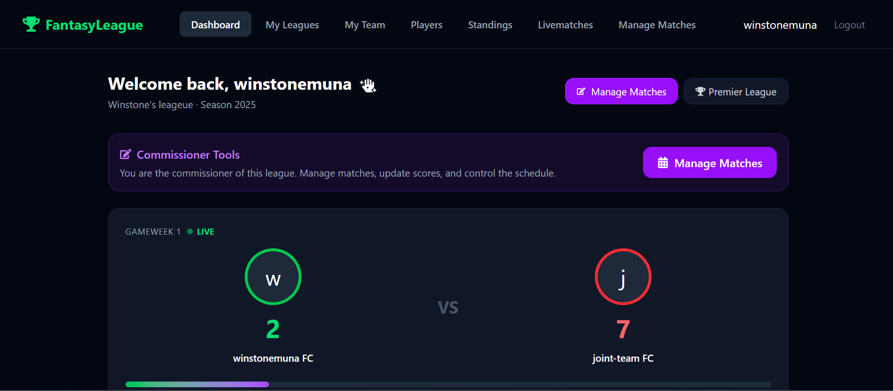
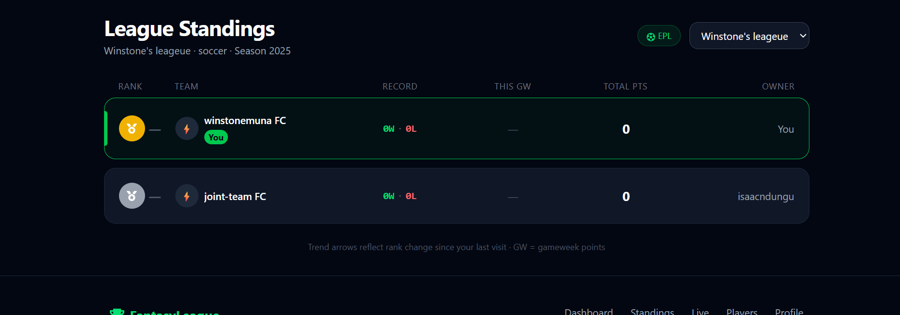
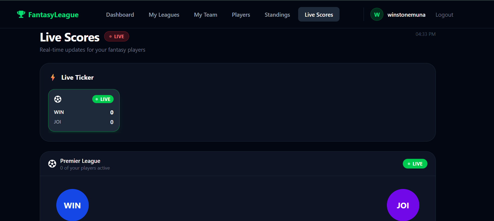
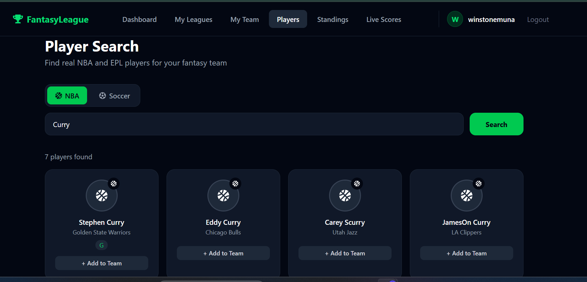
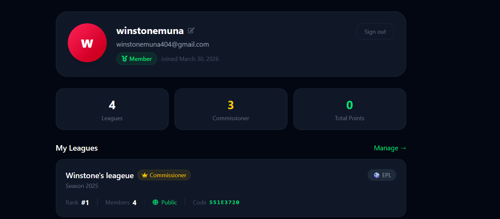

#  Fantasy League Dashboard

A full-stack fantasy sports management platform for building and tracking fantasy rosters across EPL and NBA. Built as a capstone project.

---

## Backend Server
https://github.com/winstone-1/fantasy-league-server.git

## Tech Stack

### Frontend
| Tech | Usage |
|------|-------|
| React + Vite | UI framework |
| Tailwind CSS v4 | Styling |
| React Router DOM | Client-side routing |
| Axios | API requests with JWT interceptor |
| Firebase Auth | Google sign-in + email/password |

### Backend
| Tech | Usage |
|------|-------|
| Node.js + Express | REST API |
| MongoDB + Mongoose | Database |
| JWT | Authentication tokens |
| bcryptjs | Password hashing |
| Railway | Deployment |

---

## Features

-  **Auth** — Email/password and Google sign-in via Firebase, synced to MongoDB with JWT
-  **Leagues** — Create, join (via invite code), and manage fantasy leagues
-  **Teams** — Build and manage your roster with players from EPL and NBA
-  **Standings** — Live league standings with rank trend arrows and W/L/D records
-  **Live Matches** — Real-time score ticker with 30-second polling
-  **Player Search** — Search EPL and NBA players via BallDontLie API with MongoDB caching
-  **User Profile** — View role, leagues joined, rank per league, commissioner status
-  **Role System** — `admin`, `commissioner`, `member` roles with middleware guards

---

## Project Structure

```
fantasy-league-server/         # Backend (Railway)
└── src/
    ├── controllers/           # Route handlers
    ├── middleware/            # protect, Requireleagueadmin, Requirerole
    ├── models/                # User, League, Team, Player, Match
    ├── routes/                # authRoutes, leagueRoutes, matchRoutes...
    ├── config/                # MongoDB connection
    └── index.js               # Entry point


fantasy-league-client/         # Frontend (Vercel)
└── src/
    ├── api/                   # Axios instance with JWT interceptor
    ├── components/            # Navbar, Footer, ProtectedRoute
    ├── context/               # AuthContext (Firebase + JWT)
    ├── pages/                 # Dashboard, Standings, LiveMatches, Profile...
    └── firebase.js            # Firebase config
```

---

## Installation

### 1. Clone the Repository

```bash
git clone https://github.com/winstone-1/fantasy-league.git
cd fantasy-league
```

### 2. Backend Setup

```bash
cd fantasy-league-server
npm install
```

Create a `.env` file in `fantasy-league-server/`:


```bash
npm run dev
```

### 3. Frontend Setup

```bash
cd fantasy-league-client
npm install
```

Create a `.env` file in `fantasy-league-client/`:


```bash
npm run dev
```

---

## Deployment

| Service | Platform | URL |
|---------|----------|-----|
| Backend | Railway | `https://fantasy-league-server-production.up.railway.app` |
| Frontend | Vercel | `https://fantasy-league-client.vercel.app` |

---
## Screenshots

### Login


### Dashboard


### Standings


### Live Matches


### Player Search


### User Profile


---

## API Endpoints

### Auth
| Method | Endpoint | Access |
|--------|----------|--------|
| POST | `/api/auth/register` | Public |
| POST | `/api/auth/login` | Public |
| POST | `/api/auth/google` | Public |
| GET | `/api/auth/me` | Protected |
| PUT | `/api/auth/me` | Protected |

### Leagues
| Method | Endpoint | Access |
|--------|----------|--------|
| GET | `/api/leagues` | Protected |
| POST | `/api/leagues` | Protected |
| GET | `/api/leagues/:id` | Protected |
| POST | `/api/leagues/:id/join` | Protected |
| DELETE | `/api/leagues/:id/leave` | Protected |

### Matches
| Method | Endpoint | Access |
|--------|----------|--------|
| GET | `/api/leagues/:id/matches` | Protected |
| POST | `/api/leagues/:id/matches` | Commissioner only |
| GET | `/api/matches/live` | Protected |
| PUT | `/api/matches/:matchId/score` | Commissioner only |

---


## Author

**Winstone** — [@winstone-1](https://github.com/winstone-1)

> Capstone project · 2026